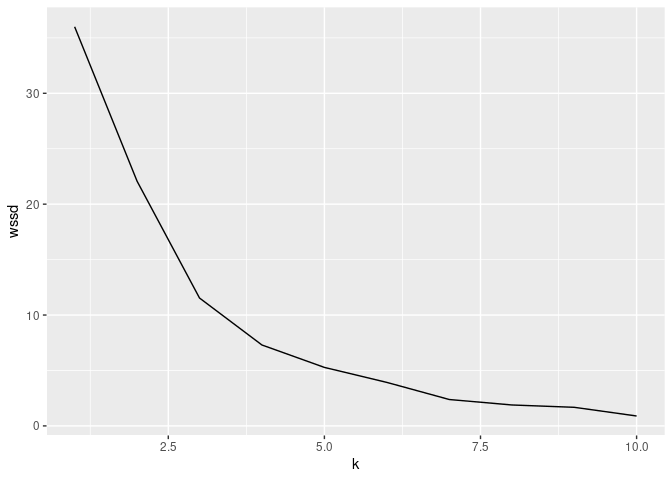

Decision Trees, Random Forests and Clustering
================
Nina Groleger
23 11 2020

``` r
library(tidyverse)
library(rpart)
#install.packages("caret") if necessary
library(caret)
library(randomForest)
```

# Part 1: Decision Trees

``` r
income <- read_csv("income.csv", col_types = "nffnfffffnff")
summary(income)
```

    ##       age               workClassification      educationLevel  educationYears 
    ##  Min.   :17.00   Private         :22696    HS-grad     :10501   Min.   : 1.00  
    ##  1st Qu.:28.00   Self-emp-not-inc: 2541    Some-college: 7291   1st Qu.: 9.00  
    ##  Median :37.00   Local-gov       : 2093    Bachelors   : 5354   Median :10.00  
    ##  Mean   :38.58   ?               : 1836    Masters     : 1723   Mean   :10.08  
    ##  3rd Qu.:48.00   State-gov       : 1297    Assoc-voc   : 1382   3rd Qu.:12.00  
    ##  Max.   :90.00   Self-emp-inc    : 1116    11th        : 1175   Max.   :16.00  
    ##                  (Other)         :  981    (Other)     : 5134                  
    ##                maritalStatus             occupation           relationship  
    ##  Married-civ-spouse   :14976   Prof-specialty :4140   Husband       :13193  
    ##  Divorced             : 4443   Craft-repair   :4099   Not-in-family : 8304  
    ##  Married-spouse-absent:  418   Exec-managerial:4066   Wife          : 1568  
    ##  Never-married        :10682   Adm-clerical   :3769   Own-child     : 5068  
    ##  Separated            : 1025   Sales          :3650   Unmarried     : 3446  
    ##  Married-AF-spouse    :   23   Other-service  :3295   Other-relative:  981  
    ##  Widowed              :  993   (Other)        :9541                         
    ##                  race          gender        workHours    
    ##  White             :27815   Male  :21789   Min.   : 1.00  
    ##  Black             : 3124   Female:10771   1st Qu.:40.00  
    ##  Asian-Pac-Islander: 1039                  Median :40.00  
    ##  Amer-Indian-Eskimo:  311                  Mean   :40.44  
    ##  Other             :  271                  3rd Qu.:45.00  
    ##                                            Max.   :99.00  
    ##                                                           
    ##        nativeCountry     income     
    ##  United-States:29169   <=50K:24719  
    ##  Mexico       :  643   >50K : 7841  
    ##  ?            :  583                
    ##  Philippines  :  198                
    ##  Germany      :  137                
    ##  Canada       :  121                
    ##  (Other)      : 1709

## Problem 1.

Using the income dataset, perform 5-fold cross validation to find a good
value of depth(you should try several values of depth).

We’re using 5-fold cross validation here, which means we divide D into 5
parts using random samples, interchange which (1) part is Dtest, the
rest are Dtrain. This is a way to “fake” having more data than we do.
Then we compute the average error so 1/5sum(erri)

``` r
test_sets <- createFolds(income$income, k=5)
err_matrix <- matrix(0, 5, 5)

for (j in 1:5){
  for (i in 1:5){
    test_idx <- unlist(test_sets[i], use.names=FALSE)
    cv_train <- income[test_idx,]
    cv_test <- income[-test_idx,]
  
    # Make models with cv_train
    treetrain <- rpart(income ~ ., data = cv_train, method="class", control = rpart.control(maxdepth=(j*2), cp=0))
  
    # Make predictions with cv_test
    treetest <- round(predict(treetrain, cv_test))
  
    # Calculate error
    testing_col <- c(cv_test$income == "<=50K")
    calc <- data.frame(real = testing_col, pred = treetest[,1]) %>% mutate(accurate = (real==pred))
    err_matrix[j, i] <- 1 - sum(calc$accurate)/length(calc$accurate)
  }
}

depth_errors <- data.frame(err_matrix) %>% mutate(average_err = rowMeans(err_matrix), depth = c(2, 4, 6, 8, 10))
depth_errors %>% ggplot(aes(x=depth, y=average_err)) +
  geom_line()
```

<!-- -->

Our lowest error is for depth 6.

## Problem 2.

Using the value of depth found in Problem 1, fit a decision tree with
this depth to the entire dataset, and visualize the tree.

Using this plot, predict the income level for a person with the
following characteristics: \* 45 years old \* Privately employed in
sales \* Bachelors degree w/ 13 years of education \* White \* 40
working hours \* From the US \* Woman \* Married

Explain in words how your model makes this prediction.

``` r
tree_model <- rpart(income ~., income, method="class", control = rpart.control(maxdepth = 6))
plot(tree_model, margin = 0.1, uniform = TRUE)
text(tree_model, fancy = FALSE, use.n = TRUE, all = TRUE)
```

<!-- -->

``` r
tree_model
```

    ## n= 32560 
    ## 
    ## node), split, n, loss, yval, (yprob)
    ##       * denotes terminal node
    ## 
    ##  1) root 32560 7841 <=50K (0.75918305 0.24081695)  
    ##    2) relationship=Not-in-family,Own-child,Unmarried,Other-relative 17799 1178 <=50K (0.93381651 0.06618349) *
    ##    3) relationship=Husband,Wife 14761 6663 <=50K (0.54860782 0.45139218)  
    ##      6) educationLevel=HS-grad,11th,9th,Some-college,Assoc-acdm,Assoc-voc,7th-8th,5th-6th,10th,1st-4th,Preschool,12th 10329 3456 <=50K (0.66540807 0.33459193)  
    ##       12) occupation=Handlers-cleaners,Other-service,Craft-repair,Transport-moving,Farming-fishing,Machine-op-inspct,?,Armed-Forces,Priv-house-serv 6293 1556 <=50K (0.75274114 0.24725886) *
    ##       13) occupation=Exec-managerial,Prof-specialty,Adm-clerical,Sales,Tech-support,Protective-serv 4036 1900 <=50K (0.52923687 0.47076313)  
    ##         26) age< 33.5 941  274 <=50K (0.70882040 0.29117960) *
    ##         27) age>=33.5 3095 1469 >50K (0.47463651 0.52536349)  
    ##           54) educationLevel=HS-grad,11th,9th,7th-8th,5th-6th,10th,1st-4th,Preschool,12th 1432  629 <=50K (0.56075419 0.43924581) *
    ##           55) educationLevel=Some-college,Assoc-acdm,Assoc-voc 1663  666 >50K (0.40048106 0.59951894) *
    ##      7) educationLevel=Bachelors,Masters,Doctorate,Prof-school 4432 1225 >50K (0.27639892 0.72360108) *

We follow the splits from the root node to a leaf. Our person is married
so we follow node 3, then the education level: Bachelors, to node 7. At
this point we don’t need to check any other splits because we’ve reached
a leaf. We predict the income level for our person is above 50k with 72%
probability.

# Part 2: Random forests

## Problem 3: Finding the number of trees

Split the income data into a training and a testing set. Then, fit
random forest models on the training data for a range of different
values of number of trees. For each model, compute the test error, and
plot it against the number of trees in the random forest. Interpret the
results.

``` r
idx <- sample(c(1:nrow(income)), round(0.8*nrow(income)), replace = FALSE)
Dtrain <- income[idx,]
Dtest <- income[-idx,]
forest_err <- rep(0, 20)

for(i in 1:50){
  forest <- randomForest(income ~., Dtrain, ntree=i)
  prediction2 <- predict(forest, Dtest)
  
  # Calculate error
  calc <- data.frame(real = Dtest$income, pred = prediction2) %>% mutate(accurate = (real==pred))
  forest_err[i] <- 1 - sum(calc$accurate)/length(calc$accurate)
}

err_frame <- data.frame(test_error = forest_err, trees = c(1:50))
err_frame %>% ggplot(aes(x=trees, y=test_error)) +
  geom_line()
```

<!-- -->

While the error is a little jittery, in general the error decreases with
an increasing number of trees. This makes sense, as a single tree has
high variance and therefore a higher test error than we would like. By
using multiple trees, we avoid this high variance, and achieve a lower
testing error.

## Problem 4.Based on your results from Problem 3, fit a random forest model to the income data with a ‘good’ number of trees.

Then, inspect the feature importances. Which feature is the most
important inpredicting income? Which feature is the least important? How
does this compare with the interpretation ofthe decision tree model in
Part 1?

``` r
# fit forest
forest2 <- randomForest(income ~., income, ntree=15, importance = TRUE)
forest2$importance
```

    ##                           <=50K         >50K MeanDecreaseAccuracy
    ## age                0.0016827060  0.094653760          0.024199810
    ## workClassification 0.0099447121  0.007785160          0.009424204
    ## educationLevel     0.0275373214  0.026196190          0.027185728
    ## educationYears     0.0304871652  0.024584209          0.029060683
    ## maritalStatus      0.0266042830  0.120614220          0.049429423
    ## occupation         0.0177118489  0.075538392          0.031694460
    ## relationship       0.0117162391  0.093644726          0.031589497
    ## race               0.0008490709  0.003339895          0.001452897
    ## gender             0.0083441005  0.010260095          0.008849905
    ## workHours          0.0031555361  0.042730100          0.012743191
    ## nativeCountry      0.0026550737 -0.002075625          0.001511214
    ##                    MeanDecreaseGini
    ## age                       1446.4778
    ## workClassification         470.4999
    ## educationLevel             807.3561
    ## educationYears             663.0087
    ## maritalStatus             1655.7091
    ## occupation                1135.1172
    ## relationship               821.0139
    ## race                       188.2024
    ## gender                     159.8215
    ## workHours                  901.7148
    ## nativeCountry              344.5488

We look at mean decrease in accuracy: The most important feature (in
this run) with respect to accuracy is marital status, and the least
important feature is native country.

# Part 3: Clustering

``` r
college <- read_csv("college.csv", col_types = "nccfffffnnnnnnnnn")
```

    ## Warning: 2 parsing failures.
    ## row               col expected actual          file
    ## 105 loan_default_rate a number   NULL 'college.csv'
    ## 216 loan_default_rate a number   NULL 'college.csv'

``` r
summary(college)
```

    ##        id             name               city               state    
    ##  Min.   :100654   Length:1270        Length:1270        PA     :101  
    ##  1st Qu.:153255   Class :character   Class :character   NY     : 84  
    ##  Median :186327   Mode  :character   Mode  :character   CA     : 71  
    ##  Mean   :187222                                         TX     : 63  
    ##  3rd Qu.:215291                                         OH     : 52  
    ##  Max.   :484905                                         IL     : 47  
    ##                                                         (Other):852  
    ##        region      highest_degree    control      gender     admission_rate  
    ##  West     :158   Graduate :1049   Private:763   CoEd :1238   Min.   :0.0509  
    ##  South    :460   Associate:  20   Public :507   Women:  28   1st Qu.:0.5339  
    ##  Northeast:299   Bachelor : 200                 Men  :   4   Median :0.6685  
    ##  Midwest  :353   Nondegree:   1                              Mean   :0.6498  
    ##                                                              3rd Qu.:0.7857  
    ##                                                              Max.   :1.0000  
    ##                                                                              
    ##     sat_avg         undergrads       tuition      faculty_salary_avg
    ##  Min.   : 720.0   Min.   :   47   Min.   : 2732   Min.   : 1451     
    ##  1st Qu.: 973.2   1st Qu.: 1294   1st Qu.: 8966   1st Qu.: 6191     
    ##  Median :1040.5   Median : 2554   Median :19995   Median : 7268     
    ##  Mean   :1059.6   Mean   : 5625   Mean   :21011   Mean   : 7655     
    ##  3rd Qu.:1120.8   3rd Qu.: 6713   3rd Qu.:30354   3rd Qu.: 8670     
    ##  Max.   :1545.0   Max.   :52280   Max.   :51008   Max.   :20650     
    ##                                                                     
    ##  loan_default_rate  median_debt         lon               lat       
    ##  Min.   :0.00000   Min.   : 6056   Min.   :-157.92   Min.   :19.71  
    ##  1st Qu.:0.03500   1st Qu.:21250   1st Qu.: -94.17   1st Qu.:35.20  
    ##  Median :0.05500   Median :24544   Median : -84.88   Median :39.74  
    ##  Mean   :0.06555   Mean   :23477   Mean   : -88.29   Mean   :38.60  
    ##  3rd Qu.:0.08300   3rd Qu.:27000   3rd Qu.: -78.63   3rd Qu.:41.81  
    ##  Max.   :0.33400   Max.   :41000   Max.   : -68.59   Max.   :61.22  
    ##  NA's   :2

## Problem 5.

  - First, perform the following: create a new dataset consisting of
    colleges only in the state of Maryland, and keep only the features
    admission\_rate and sat\_avg.
  - Then, scale the dataset, and perform K-means clustering with K= 1,2,
    . . . ,10 using the Euclidean distance (you can either use your
    implementation of K-means that you wrote in lab, or an imported
    R/Python function).
  - Then, compute the within-cluster sum of squared distances (WSSD) for
    each value of K, and plot it against K. Using the elbow method, what
    do you think is a good value of K for this problem?
  - Visualize the clusters at this value of K, and interpret the
    results.

<!-- end list -->

``` r
ma <- college %>% filter(state == "MD") %>% select(admission_rate, sat_avg)
ma_scaled <- scale(ma)
km_df <- data.frame(k = c(1:10), wssd = rep(0, 10))
for (i in 1:10){
  km_df$wssd[i] <- kmeans(ma_scaled, i)$tot.withinss
}

km_df %>% ggplot(aes(x=k, y=wssd)) +
  geom_line()
```

<!-- -->

Looking at the “elbow” of the graph, we pick k=4.

``` r
# Visualize the clusters at this value of K, and interpret the results.
k4_all <- kmeans(ma_scaled, 4)
data_clusters <- data.frame(ma_scaled, cluster = as.factor(k4_all$cluster))
ggplot(data_clusters, aes(x=admission_rate, y=sat_avg)) +
  geom_point(aes(color=cluster))
```

<!-- --> The difference
between k = 3 and k = 4 is really that top left result, which is very
different from the rest. With k = 4, we can cluster the remaining data
into 3 categories. It seems the clusters are (1) low sat\_avg, (2)
medium sat\_avg with medium admission\_rate and (3) medium sat\_avg with
high admission\_rate.

## Problem 6.

Create a new dataset consisting of colleges in Maryland, and keep the
features admission\_rate,sat\_avg and control. Scale the continuous
features admission\_rate and sat\_avg. Using this dataset,compute the
distance matrix D as defined in the hw doc, and use it to perform
heirarchical clustering. Compare the clusters you obtain to those
obtained in Problem 5 with K-means clustering.

``` r
sat_adm <- ma_scaled
control <- college %>% filter(state == "MD") %>% select(control)
ma_df <- data.frame(sat_adm, control)
```

``` r
# We make our distance matrix, the (i, j)th entry is d(xi, xj)
dist_mat <- matrix(0, nrow(ma_df), nrow(ma_df))
for (i in 1:nrow(ma_df)){
  for (j in 1:nrow(ma_df)){
    point_dist <- sqrt((ma_df$admission_rate[i] - ma_df$admission_rate[j])^2 +
      (ma_df$sat_avg[i] - ma_df$sat_avg[j])^2)
    if (ma_df$control[i] != ma_df$control[j]){
      point_dist <- point_dist + 1
    }
    dist_mat[i, j] <- point_dist
  }
}
```

``` r
dist_d <- as.dist(dist_mat)
clusters <- hclust(dist_d)
plot(clusters)
```

<!-- -->

These are comparable to our problem 5 visualization. Note that 1 is very
separate from the rest of our points - this is the point on the left
upper side of the graph. In fact, we can see all of our four clusters in
this visualization but it’s also easier to see what clustering would
look like with a lower or higher k. However, this kind of visualization
doesn’t tell us which features influenced the clustering more so we
can’t say how much the control of the college influences the
clustering.
